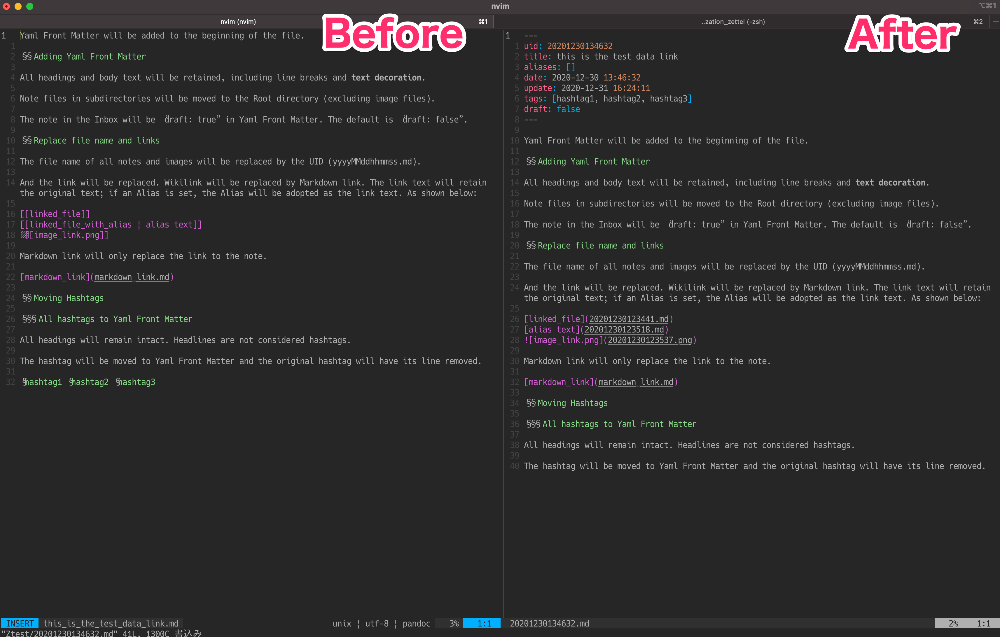

# Note normalization for Zettelkasten

Note normalization for Zettelkasten. Add Yaml Front Matter, add UIDs and rename files, replace Wikilink with Markdown link, etc.

Normalizing notes reduces dependence on tools and increases the flexibility and independence of Zettelkasten notes. This is useful for transforming a knowledge notebook into a permanent notebook.


1. [Screenshots](#screenshots)
2. [Features](#features)
3. [Requirements](#requirements)
4. [Installation](#installation)
5. [Usage](#usage)
6. [Note](#note)
7. [Future works (TODO)](#future-works-todo)
8. [Author](#author)
9. [Preview images](#preview-images)

## Screenshots



## Features

- Automatically generate Yaml Front Matter from the note information and insert it into the header
- Move hashtags to Yaml Front Matter
- Rename the file to UID
- Move the Markdown file to the Zettelkasten's root folder
- Replace link (filename and folder)
- Change Wikilinks to Markdown links (with Relative Paths and Extensions)
- Support for Markdown files and images

## Requirements

- Python 3.9.1 or above

## Installation

Download or clone this repository
(It only needs normalization_zettel.py to work.)

## Usage

Just run "normalization_zettel.py".
The first argument is the root folder of Zettelkasten.

```zsh
python normalization_zettel.py /path/to/your/zettelkasten_root_folder
```

The following options can be specified.

positional arguments:
  root                         Zettelkasten's root folder

optional arguments:
  -h, --help                    show help message and exit
  -t TARGET, --target TARGET    normalization target folder or file
  -y, --yes                     automatically answer yes to all questions

For example, if you put the following in the pre-commit hook of Git Hooks(.git/hooks/pre-commit), you can run this program only on the notes that have changed.

```zsh
git diff --cached --name-status | grep -e "^M" -e "^A" | while read a b; do
  python3 /usr/local/bin/normalization_zettel.py /path/to/your/zettelkasten_root_folder -t "$b" -y
  git add "$b"
done
```

The execution log was saved to a log file. please see ./normalization_zettel.log files.

## Note

This program is mainly designed to fix my Zettelkasten, so if you use it, please test it beforehand to make sure it fits your Zettelkasten well.

You can check the results of the program execution in the "debug.log" file in the same folder.

It is recommended that you first copy all of your Zettelkasten and test run in the copied folder. Then check the file after the run and make sure the notes are modified as expected in copied folder.

It is strongly recommended to back up Zettelkasten using a mechanism such as git, even when running on production data. Not only should you be able to revert to the pre-run data, but you should also be able to see the differences for each file, like in Git diff, and repair them if necessary.

## Future works (TODO)

- Windows and Linux support
- Toml and json Front Matter support

## Author

- [jMatsuzaki](https://jmatsuzaki.com/)
- [jMatsuzaki Inc.](https://jmatsuzaki.com/company)
- [@jmatsuzaki](https://twitter.com/jmatsuzaki)

## Preview images

Preview images were taken using:

- [iTerm2](https://iterm2.com/) terminal emulator on macOS
- [onedark.vim](https://github.com/joshdick/onedark.vim) on [Neovim](https://github.com/neovim/neovim)
